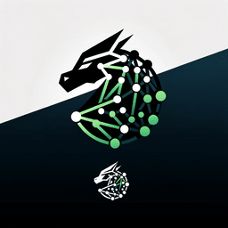

# DragonTrack

**This project was accepted in WACV 2025!** 🎉



DragonTrack is a dynamic robust adaptive graph-based tracker designed as an end-to-end framework for multi-person tracking (MPT). It integrates a detection transformer model for object detection and feature extraction with a graph convolutional network for re-identification.

## Architecture

DragonTrack leverages encoded features from the transformer model to facilitate precise subject matching and track maintenance. The graph convolutional network processes these features alongside geometric data to predict subsequent positions of tracked individuals. This approach aims to enhance tracking accuracy and reliability, leading to improvements in key metrics such as higher order tracking accuracy (HOTA) and multiple object tracking accuracy (MOTA).

## Key Features

- Integration of detection transformer for object detection and feature extraction.
- Utilization of graph convolutional networks for re-identification and track prediction.
- Focus on enhancing tracking accuracy and reliability.
- Outperforms state-of-the-art MOT methods on MOT17 datasets, achieving 82.0 and 65.3 in MOTA and HOTA, respectively.

## Installation

Follow these steps to set up your environment and install the necessary dependencies:

1. **Clone the Repository**

   Clone the DragonTrack repository to your local machine.

   ```bash
   git clone https://yourprojectrepository.com/DragonTrack
   cd DragonTrack
   ```
## Set Up the Environment

Use Conda to manage your environment and dependencies. If you do not have Conda installed, download it from [Miniconda](https://docs.conda.io/en/latest/miniconda.html) or [Anaconda](https://www.anaconda.com/products/individual).

- **Create a new Conda environment:**

  ```bash
  conda create --name dragontrack python=3.8
  ```

- **Activate the Conda environment:**

  ```bash
  conda activate dragontrack
  ```

## Install Dependencies

Install required packages from `requirements.txt`.

```bash
pip install -r requirements.txt
```

## Download and Prepare the MOT17 Dataset

Download the MOT17 Dataset from the [MOT Challenge website](https://motchallenge.net/data/MOT17/) and place it in a folder named `MOT_dataset`.

```bash
mkdir -p MOT_dataset
# Download the dataset into the MOT_dataset folder
```

## Prepare the Environment

Run the script to create necessary folders.

```bash
./create_folders.sh
```

## Training

- **Command:** Run the training script.

  ```bash
  ./train.sh
  ```

- **Result:** Training starts, saving trained models in `/models`. Modify settings in `tracking.py`.

## Testing

- **Specify the trained model in `tracking.py`.**
- **Command:** Initiate testing.

  ```bash
  ./test.sh
  ```

- **Result:** Generates `.txt` files and videos, saved in `/output`. Settings can be changed in `tracking.py`.

## Benchmark Evaluation

Pre-processed Tracktor detection files from [this repository](https://github.com/dvl-tum/mot_neural_solver) were used for benchmark evaluation.


## Citation

If you use this code or dataset for your research, please consider citing our paper:

```bibtex
@inproceedings{Amraee2025DragonTrack,
  title={Transformer-Enhanced Graphical Multi-Person Tracking in Complex Scenarios},
  author={Bishoy Galoaa and Somaieh Amraee and Sarah Ostadabbas},
  booktitle={IEEE/CVF Winter Conference on Applications of Computer Vision (WACV)},
  month={1},
  year={2025}
}


